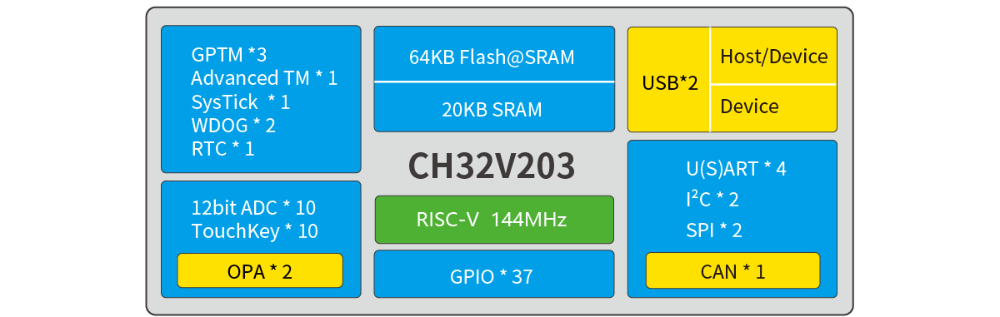
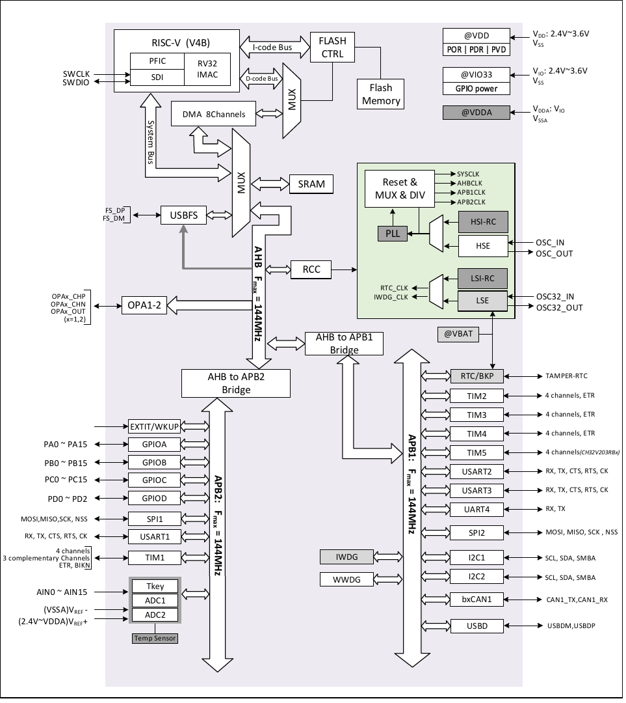

[CH32V203/[CH32V208](README_CH32V208.md)]

# CH32V203

| SWCLK | SWDIO | TX1 | RX1  | TX2 | RX2 | TX3  | RX3  | TX4  | RX4  |
|-------|-------|-----|------|-----|-----|------|------|------|------|
| PA14  | PA13  | PA9 | PA10 | PA2 | PA3 | PB10 | PB11 | PB0  | PB1  |

## Official Site

- https://www.wch-ic.com/products/CH32V203.html
- https://www.wch.cn/products/CH32V203.html

## System Block Diagram

## System Architecture

## Comparison

## Pin Definitions
