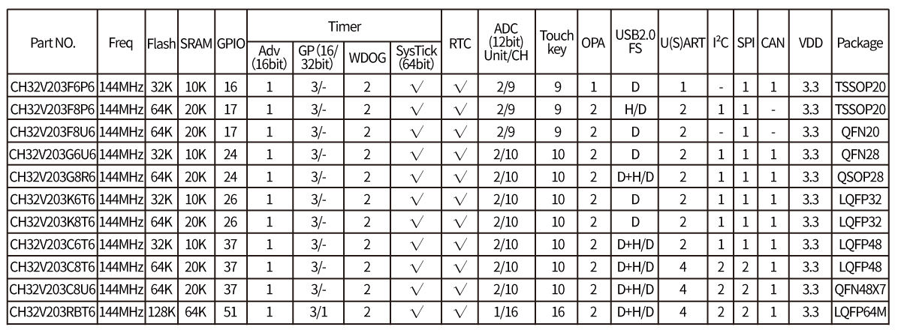

[CH32V203/[CH32V208](README_CH32V208.md)]

# CH32V203

| SWCLK | SWDIO | TX1 | RX1  | TX2 | RX2 | TX3  | RX3  | TX4  | RX4  |
|-------|-------|-----|------|-----|-----|------|------|------|------|
| PA14  | PA13  | PA9 | PA10 | PA2 | PA3 | PB10 | PB11 | PB0  | PB1  |

Pin Alternate Functions
[[ALL](https://ch32-riscv-ug.github.io/ch32_riscv_tools/PinAlternateFunctions/?chip=CH32V203)]
[[ADC](https://ch32-riscv-ug.github.io/ch32_riscv_tools/PinAlternateFunctions/?chip=CH32V203&features=ADC)]
[[I2C](https://ch32-riscv-ug.github.io/ch32_riscv_tools/PinAlternateFunctions/?chip=CH32V203&features=I2C)]
[[SPI](https://ch32-riscv-ug.github.io/ch32_riscv_tools/PinAlternateFunctions/?chip=CH32V203&features=SPI)]
[[SYS](https://ch32-riscv-ug.github.io/ch32_riscv_tools/PinAlternateFunctions/?chip=CH32V203&features=SYS)]
[[TIM](https://ch32-riscv-ug.github.io/ch32_riscv_tools/PinAlternateFunctions/?chip=CH32V203&features=TIM)]
[[UART/USART](https://ch32-riscv-ug.github.io/ch32_riscv_tools/PinAlternateFunctions/?chip=CH32V203&features=ART)]
[[USB](https://ch32-riscv-ug.github.io/ch32_riscv_tools/PinAlternateFunctions/?chip=CH32V203&features=USB)]

## Official Site

- https://www.wch-ic.com/products/CH32V203.html
- https://www.wch.cn/products/CH32V203.html

## Datasheet
- en [[CH32V203DS0.PDF](https://ch32-riscv-ug.github.io/CH32V20x/datasheet_en/CH32V203DS0.PDF)] [[CH32FV2x_V3xRM.PDF](https://ch32-riscv-ug.github.io/CH32V20x/datasheet_en/CH32FV2x_V3xRM.PDF)]
- zh [[CH32V203DS0.PDF](https://ch32-riscv-ug.github.io/CH32V20x/datasheet_zh/CH32V203DS0.PDF)] [[CH32FV2x_V3xRM.PDF](https://ch32-riscv-ug.github.io/CH32V20x/datasheet_zh/CH32FV2x_V3xRM.PDF)]

## System Block Diagram

### CH32V203

## Pin Definitions
<table>
    <thead>
        <tr>
            <th>F6&#8203;(&#8203;TSSOP&#8203;20)</th>
            <th>F8&#8203;(&#8203;TSSOP&#8203;20)</th>
            <th>F8&#8203;(&#8203;QFN&#8203;20)</th>
            <th>G6&#8203;(&#8203;QFN&#8203;28)</th>
            <th>G8&#8203;(&#8203;QSOP&#8203;28)</th>
            <th>K6/K8&#8203;(&#8203;LQFP&#8203;32)</th>
            <th>C6&#8203;(&#8203;LQFP&#8203;48)</th>
            <th>C8&#8203;(&#8203;QFN&#8203;48)</th>
            <th>RB&#8203;(&#8203;LQFP&#8203;64M)</th>
            <th>Pin name</th>
            <th>Pin type</th>
            <th>I/O struc&shy;ture</th>
            <th>Main function&#8203;(after reset)</th>
            <th>Note</th>
        </tr>
    </thead>
    <tbody align="center">
        <tr>
            <td>6</td>
            <td>6</td>
            <td>1</td>
            <td>6</td>
            <td>9</td>
            <td>6</td>
            <td>10</td>
            <td>10</td>
            <td>14</td>
            <td>PA0-WKUP</td>
            <td>I/O/A</td>
            <td>-</td>
            <td>PA0</td>
            <td></td>
        </tr>
        <tr>
            <td>7</td>
            <td>7</td>
            <td>2</td>
            <td>7</td>
            <td>10</td>
            <td>7</td>
            <td>11</td>
            <td>11</td>
            <td>15</td>
            <td>PA1</td>
            <td>I/O/A</td>
            <td>-</td>
            <td>PA1</td>
            <td></td>
        </tr>
        <tr>
            <td>8</td>
            <td>8</td>
            <td>3</td>
            <td>8</td>
            <td>11</td>
            <td>8</td>
            <td>12</td>
            <td>12</td>
            <td>16</td>
            <td>PA2</td>
            <td>I/O/A</td>
            <td>-</td>
            <td>PA2</td>
            <td>TX2</td>
        </tr>
        <tr>
            <td>9</td>
            <td>9</td>
            <td>4</td>
            <td>9</td>
            <td>12</td>
            <td>9</td>
            <td>13</td>
            <td>13</td>
            <td>17</td>
            <td>PA3</td>
            <td>I/O/A</td>
            <td>-</td>
            <td>PA3</td>
            <td>RX2</td>
        </tr>
        <tr>
            <td>10</td>
            <td>11</td>
            <td>5</td>
            <td>10</td>
            <td>15</td>
            <td>10</td>
            <td>14</td>
            <td>14</td>
            <td>20</td>
            <td>PA4</td>
            <td>I/O/A</td>
            <td>-</td>
            <td>PA4</td>
            <td></td>
        </tr>
        <tr>
            <td>11</td>
            <td>12</td>
            <td>6</td>
            <td>11</td>
            <td>16</td>
            <td>11</td>
            <td>15</td>
            <td>15</td>
            <td>21</td>
            <td>PA5</td>
            <td>I/O/A</td>
            <td>-</td>
            <td>PA5</td>
            <td></td>
        </tr>
        <tr>
            <td>12</td>
            <td>10</td>
            <td>20</td>
            <td>12</td>
            <td>13</td>
            <td>12</td>
            <td>16</td>
            <td>16</td>
            <td>22</td>
            <td>PA6</td>
            <td>I/O/A</td>
            <td>-</td>
            <td>PA6</td>
            <td></td>
        </tr>
        <tr>
            <td>13</td>
            <td>13</td>
            <td>7</td>
            <td>13</td>
            <td>17</td>
            <td>13</td>
            <td>17</td>
            <td>17</td>
            <td>23</td>
            <td>PA7</td>
            <td>I/O/A</td>
            <td>-</td>
            <td>PA7</td>
            <td></td>
        </tr>
        <tr>
            <td>-</td>
            <td>18</td>
            <td>14</td>
            <td>18</td>
            <td>24</td>
            <td>18</td>
            <td>29</td>
            <td>29</td>
            <td>41</td>
            <td>PA8</td>
            <td>I/O</td>
            <td>FT</td>
            <td>PA8</td>
            <td></td>
        </tr>
        <tr>
            <td></td>
            <td>19</td>
            <td>15</td>
            <td></td>
            <td>25</td>
            <td>19</td>
            <td>30</td>
            <td>30</td>
            <td>42</td>
            <td>PA9</td>
            <td>I/O</td>
            <td>FT</td>
            <td>PA9</td>
            <td>TX1</td>
        </tr>
        <tr>
            <td>-</td>
            <td>20</td>
            <td>18</td>
            <td>19</td>
            <td>26</td>
            <td>20</td>
            <td>31</td>
            <td>31</td>
            <td>43</td>
            <td>PA10</td>
            <td>I/O</td>
            <td>FT</td>
            <td>PA10</td>
            <td>RX1</td>
        </tr>
        <tr>
            <td>17</td>
            <td>-</td>
            <td>17</td>
            <td>19</td>
            <td>27</td>
            <td>21</td>
            <td>32</td>
            <td>32</td>
            <td>44</td>
            <td>PA11</td>
            <td>I/O/A</td>
            <td>FT</td>
            <td>PA11</td>
            <td></td>
        </tr>
        <tr>
            <td>18</td>
            <td>-</td>
            <td>16</td>
            <td>20</td>
            <td>28</td>
            <td>22</td>
            <td>33</td>
            <td>33</td>
            <td>45</td>
            <td>PA12</td>
            <td>I/O/A</td>
            <td>FT</td>
            <td>PA12</td>
            <td></td>
        </tr>
        <tr>
            <td>19</td>
            <td>1</td>
            <td>16</td>
            <td>21</td>
            <td>28</td>
            <td>23</td>
            <td>34</td>
            <td>34</td>
            <td>46</td>
            <td>PA13</td>
            <td>I/O</td>
            <td>FT</td>
            <td>SWDIO</td>
            <td>SWDIO</td>
        </tr>
        <tr>
            <td>20</td>
            <td>2</td>
            <td>17</td>
            <td>22</td>
            <td>1</td>
            <td>24</td>
            <td>37</td>
            <td>37</td>
            <td>49</td>
            <td>PA14</td>
            <td>I/O</td>
            <td>FT</td>
            <td>SWCLK</td>
            <td>SWCLK</td>
        </tr>
        <tr>
            <td>-</td>
            <td></td>
            <td>-</td>
            <td>23</td>
            <td></td>
            <td>25</td>
            <td>38</td>
            <td>38</td>
            <td>50</td>
            <td>PA15</td>
            <td>I/O</td>
            <td>FT</td>
            <td>PA15</td>
            <td></td>
        </tr>
        <tr>
            <td>-</td>
            <td>14</td>
            <td>8</td>
            <td>14</td>
            <td>14</td>
            <td>14</td>
            <td>18</td>
            <td>18</td>
            <td>26</td>
            <td>PB0</td>
            <td>I/O/A</td>
            <td>-</td>
            <td>PB0</td>
            <td>TX4</td>
        </tr>
        <tr>
            <td>14</td>
            <td>-</td>
            <td>9</td>
            <td>15</td>
            <td>20</td>
            <td>15</td>
            <td>19</td>
            <td>19</td>
            <td>27</td>
            <td>PB1</td>
            <td>I/O/A</td>
            <td>-</td>
            <td>PB1</td>
            <td>RX4</td>
        </tr>
        <tr>
            <td></td>
            <td></td>
            <td>-</td>
            <td></td>
            <td></td>
            <td>-</td>
            <td>20</td>
            <td>20</td>
            <td>28</td>
            <td>PB2</td>
            <td>I/O</td>
            <td>FT</td>
            <td>PB2</td>
            <td></td>
        </tr>
        <tr>
            <td>-</td>
            <td></td>
            <td>-</td>
            <td>24</td>
            <td></td>
            <td>26</td>
            <td>39</td>
            <td>39</td>
            <td>55</td>
            <td>PB3</td>
            <td>I/O</td>
            <td>FT</td>
            <td>PB3</td>
            <td></td>
        </tr>
        <tr>
            <td>-</td>
            <td></td>
            <td>-</td>
            <td>25</td>
            <td></td>
            <td>27</td>
            <td>40</td>
            <td>40</td>
            <td>56</td>
            <td>PB4</td>
            <td>I/O</td>
            <td>FT</td>
            <td>PB4</td>
            <td></td>
        </tr>
        <tr>
            <td>-</td>
            <td>-</td>
            <td>-</td>
            <td>26</td>
            <td>1</td>
            <td>28</td>
            <td>41</td>
            <td>41</td>
            <td>57</td>
            <td>PB5</td>
            <td>I/O</td>
            <td>FT</td>
            <td>PB5</td>
            <td></td>
        </tr>
        <tr>
            <td>-</td>
            <td>1</td>
            <td>-</td>
            <td>27</td>
            <td>2</td>
            <td>29</td>
            <td>42</td>
            <td>42</td>
            <td>58</td>
            <td>PB6</td>
            <td>I/O</td>
            <td>FT</td>
            <td>PB6</td>
            <td></td>
        </tr>
        <tr>
            <td>-</td>
            <td>2</td>
            <td>-</td>
            <td>28</td>
            <td>3</td>
            <td>30</td>
            <td>43</td>
            <td>43</td>
            <td>59</td>
            <td>PB7</td>
            <td>I/O</td>
            <td>FT</td>
            <td>PB7</td>
            <td></td>
        </tr>
        <tr>
            <td>1</td>
            <td>-</td>
            <td>-</td>
            <td>1</td>
            <td>5</td>
            <td>31</td>
            <td>45</td>
            <td>45</td>
            <td>61</td>
            <td>PB8</td>
            <td>I/O/A</td>
            <td>FT</td>
            <td>PB8</td>
            <td></td>
        </tr>
        <tr>
            <td></td>
            <td></td>
            <td>-</td>
            <td></td>
            <td></td>
            <td>-</td>
            <td>46</td>
            <td>46</td>
            <td>62</td>
            <td>PB9</td>
            <td>I/O/A</td>
            <td>FT</td>
            <td>PB9</td>
            <td></td>
        </tr>
        <tr>
            <td></td>
            <td>-</td>
            <td>10</td>
            <td></td>
            <td>18</td>
            <td>-</td>
            <td>21</td>
            <td>21</td>
            <td>29</td>
            <td>PB10</td>
            <td>I/O/A</td>
            <td>FT</td>
            <td>PB10</td>
            <td>TX3</td>
        </tr>
        <tr>
            <td></td>
            <td>-</td>
            <td>11</td>
            <td></td>
            <td>19</td>
            <td>-</td>
            <td>22</td>
            <td>22</td>
            <td>30</td>
            <td>PB11</td>
            <td>I/O/A</td>
            <td>FT</td>
            <td>PB11</td>
            <td>RX3</td>
        </tr>
        <tr>
            <td></td>
            <td>-</td>
            <td>-</td>
            <td></td>
            <td>20</td>
            <td>-</td>
            <td>25</td>
            <td>25</td>
            <td>33</td>
            <td>PB12</td>
            <td>I/O/A</td>
            <td>FT</td>
            <td>PB12</td>
            <td></td>
        </tr>
        <tr>
            <td></td>
            <td>15</td>
            <td>-</td>
            <td></td>
            <td>21</td>
            <td>-</td>
            <td>26</td>
            <td>26</td>
            <td>34</td>
            <td>PB13</td>
            <td>I/O/A</td>
            <td>FT</td>
            <td>PB13</td>
            <td></td>
        </tr>
        <tr>
            <td></td>
            <td>16</td>
            <td>12</td>
            <td></td>
            <td>22</td>
            <td>-</td>
            <td>27</td>
            <td>27</td>
            <td>35</td>
            <td>PB14</td>
            <td>I/O/A</td>
            <td>FT</td>
            <td>PB14</td>
            <td></td>
        </tr>
        <tr>
            <td></td>
            <td>17</td>
            <td>13</td>
            <td></td>
            <td>23</td>
            <td>-</td>
            <td>28</td>
            <td>28</td>
            <td>36</td>
            <td>PB15</td>
            <td>I/O/A</td>
            <td>FT</td>
            <td>PB15</td>
            <td></td>
        </tr>
        <tr>
            <td></td>
            <td></td>
            <td>-</td>
            <td></td>
            <td></td>
            <td></td>
            <td></td>
            <td></td>
            <td>8</td>
            <td>PC0</td>
            <td>I/O/A</td>
            <td>-</td>
            <td>PC0</td>
            <td></td>
        </tr>
        <tr>
            <td></td>
            <td></td>
            <td>-</td>
            <td></td>
            <td></td>
            <td></td>
            <td></td>
            <td></td>
            <td>9</td>
            <td>PC1</td>
            <td>I/O/A</td>
            <td>-</td>
            <td>PC1</td>
            <td></td>
        </tr>
        <tr>
            <td></td>
            <td></td>
            <td>-</td>
            <td></td>
            <td></td>
            <td></td>
            <td></td>
            <td></td>
            <td>10</td>
            <td>PC2</td>
            <td>I/O/A</td>
            <td>-</td>
            <td>PC2</td>
            <td></td>
        </tr>
        <tr>
            <td></td>
            <td></td>
            <td>-</td>
            <td></td>
            <td></td>
            <td></td>
            <td></td>
            <td></td>
            <td>11</td>
            <td>PC3</td>
            <td>I/O/A</td>
            <td>-</td>
            <td>PC3</td>
            <td></td>
        </tr>
        <tr>
            <td></td>
            <td></td>
            <td>-</td>
            <td></td>
            <td></td>
            <td></td>
            <td></td>
            <td></td>
            <td>24</td>
            <td>PC4</td>
            <td>I/O/A</td>
            <td></td>
            <td>PC4</td>
            <td></td>
        </tr>
        <tr>
            <td></td>
            <td></td>
            <td></td>
            <td></td>
            <td></td>
            <td></td>
            <td></td>
            <td></td>
            <td>25</td>
            <td>PC5</td>
            <td>I/O/A</td>
            <td></td>
            <td>PC5</td>
            <td></td>
        </tr>
        <tr>
            <td></td>
            <td></td>
            <td></td>
            <td></td>
            <td></td>
            <td></td>
            <td></td>
            <td></td>
            <td>37</td>
            <td>PC6</td>
            <td>I/O/A</td>
            <td>FT</td>
            <td>PC6</td>
            <td></td>
        </tr>
        <tr>
            <td></td>
            <td></td>
            <td></td>
            <td></td>
            <td></td>
            <td></td>
            <td></td>
            <td></td>
            <td>38</td>
            <td>PC7</td>
            <td>I/O/A</td>
            <td>FT</td>
            <td>PC7</td>
            <td></td>
        </tr>
        <tr>
            <td></td>
            <td></td>
            <td></td>
            <td></td>
            <td></td>
            <td></td>
            <td></td>
            <td></td>
            <td>39</td>
            <td>PC8</td>
            <td>I/O/A</td>
            <td>FT</td>
            <td>PC8</td>
            <td></td>
        </tr>
        <tr>
            <td></td>
            <td></td>
            <td></td>
            <td></td>
            <td></td>
            <td></td>
            <td></td>
            <td></td>
            <td>40</td>
            <td>PC9</td>
            <td>I/O/A</td>
            <td>FT</td>
            <td>PC9</td>
            <td></td>
        </tr>
        <tr>
            <td></td>
            <td></td>
            <td></td>
            <td></td>
            <td></td>
            <td></td>
            <td></td>
            <td></td>
            <td>51</td>
            <td>PC10</td>
            <td>I/O</td>
            <td>FT</td>
            <td>PC10</td>
            <td></td>
        </tr>
        <tr>
            <td></td>
            <td></td>
            <td></td>
            <td></td>
            <td></td>
            <td></td>
            <td></td>
            <td></td>
            <td>52</td>
            <td>PC11</td>
            <td>I/O</td>
            <td>FT</td>
            <td>PC11</td>
            <td></td>
        </tr>
        <tr>
            <td></td>
            <td></td>
            <td></td>
            <td></td>
            <td></td>
            <td></td>
            <td></td>
            <td></td>
            <td>53</td>
            <td>PC12</td>
            <td>I/O</td>
            <td>FT</td>
            <td>PC12</td>
            <td></td>
        </tr>
        <tr>
            <td></td>
            <td></td>
            <td></td>
            <td></td>
            <td></td>
            <td>-</td>
            <td>2</td>
            <td>2</td>
            <td>2</td>
            <td>PC13 TAMPER RTC</td>
            <td>I/O</td>
            <td>-</td>
            <td>PC13</td>
            <td></td>
        </tr>
        <tr>
            <td></td>
            <td></td>
            <td></td>
            <td></td>
            <td></td>
            <td>-</td>
            <td>3</td>
            <td>3</td>
            <td>3</td>
            <td>PC14 OSC32_IN</td>
            <td>I/O/A</td>
            <td>-</td>
            <td>PC14</td>
            <td></td>
        </tr>
        <tr>
            <td></td>
            <td></td>
            <td></td>
            <td></td>
            <td></td>
            <td>-</td>
            <td>4</td>
            <td>4</td>
            <td>4</td>
            <td>PC15 OSC32_OUT</td>
            <td>I/O/A</td>
            <td>-</td>
            <td>PC15</td>
            <td></td>
        </tr>
        <tr>
            <td></td>
            <td></td>
            <td></td>
            <td></td>
            <td></td>
            <td>2</td>
            <td>5</td>
            <td>5</td>
            <td>5</td>
            <td>OSC_IN</td>
            <td>I/A</td>
            <td>-</td>
            <td>OSC_IN</td>
            <td>(PD0)</td>
        </tr>
        <tr>
            <td></td>
            <td></td>
            <td></td>
            <td></td>
            <td></td>
            <td>3</td>
            <td>6</td>
            <td>6</td>
            <td>6</td>
            <td>OSC_OUT</td>
            <td>O/A</td>
            <td>-</td>
            <td>OSC_OUT</td>
            <td>(PD1)</td>
        </tr>
        <tr>
            <td></td>
            <td></td>
            <td></td>
            <td></td>
            <td></td>
            <td></td>
            <td></td>
            <td></td>
            <td>54</td>
            <td>PD2</td>
            <td>I/O</td>
            <td>FT</td>
            <td>PD2</td>
            <td></td>
        </tr>
    </tbody>
</table>

## System Architecture

