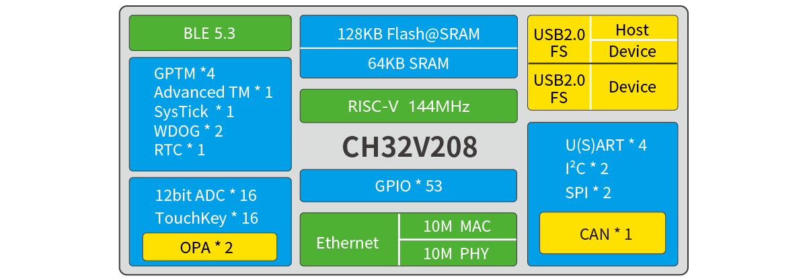
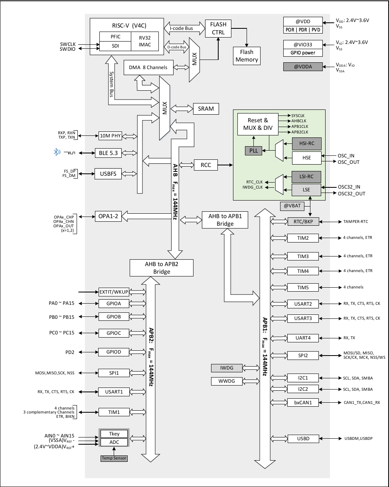

[[CH32V203](README_CH32V203.md)/CH32V208]

# CH32V208

| SWCLK | SWDIO | TX1 | RX1  | TX2 | RX2 | TX3  | RX3  | TX4  | RX4  |
|-------|-------|-----|------|-----|-----|------|------|------|------|
| PA14  | PA13  | PA9 | PA10 | PA2 | PA3 | PB10 | PB11 | PB0  | PB1  |

## Official Site

- https://www.wch-ic.com/products/CH32V208.html
- https://www.wch.cn/products/CH32V208.html

## System Block Diagram

## System Architecture

## Comparison
<table>
    <thead>
        <tr>
            <th colspan="3" rowspan="2"></th>
            <th colspan="4">CH32V208</th>
        </tr>
        <tr>
            <th>GB</th>
            <th>CB</th>
            <th>RB</th>
            <th>WB</th>
        </tr>
    </thead>
    <tbody align="center">
        <tr>
            <td colspan="3">Pin count</td>
            <td>28</td>
            <td>48</td>
            <td>64</td>
            <td>68</td>
        </tr>
        <tr>
            <td colspan="3">Flash (bytes)</td>
            <td>128K</td>
            <td>128K</td>
            <td>128K</td>
            <td>128K</td>
        </tr>
        <tr>
            <td colspan="3">SRAM (bytes)</td>
            <td>64K</td>
            <td>64K</td>
            <td>64K</td>
            <td>64K</td>
        </tr>
        <tr>
            <td colspan="3">GPIO port count</td>
            <td>21</td>
            <td>37</td>
            <td>49</td>
            <td>53</td>
        </tr>
        <tr>
            <td colspan="3">GPIO power supply</td>
            <td colspan="3">Shared with VDD</td>
            <td>Independent VIO</td>
        </tr>
        <tr>
            <td rowspan="5">Timer</td>
            <td colspan="2">Advanced-control (16 bits)</td>
            <td>1</td>
            <td>1</td>
            <td>1</td>
            <td>1</td>
        </tr>
        <tr>
            <td colspan="2">General-purpose (16 bits)</td>
            <td>3</td>
            <td>3</td>
            <td>3</td>
            <td>3</td>
        </tr>
        <tr>
            <td colspan="2">General-purpose (32 bits)</td>
            <td>1</td>
            <td>1</td>
            <td>1</td>
            <td>1</td>
        </tr>
        <tr>
            <td colspan="2">Watchdog</td>
            <td>2</td>
            <td>2</td>
            <td>2</td>
            <td>2</td>
        </tr>
        <tr>
            <td colspan="2">SysTick (24 bits)</td>
            <td colspan="4">supported</td>
        </tr>
        <tr>
            <td colspan="3">RTC</td>
            <td colspan="4">supported</td>
        </tr>
        <tr>
            <td colspan="3">ADC/TKey (channel@ unit count)</td>
            <td>8@1</td>
            <td>16@1</td>
            <td>16@1</td>
            <td>16@1</td>
        </tr>
        <tr>
            <td colspan="3">OPA</td>
            <td>OPA2</td>
            <td>2</td>
            <td>2</td>
            <td>2</td>
        </tr>
        <tr>
            <td rowspan="8">Communication interfaces</td>
            <td colspan="2">USART/UART</td>
            <td>2</td>
            <td>4</td>
            <td>4</td>
            <td>4</td>
        </tr>
        <tr>
            <td colspan="2">SPI</td>
            <td>1</td>
            <td>2</td>
            <td>2</td>
            <td>2</td>
        </tr>
        <tr>
            <td colspan="2">I2C</td>
            <td>1</td>
            <td>2</td>
            <td>2</td>
            <td>2</td>
        </tr>
        <tr>
            <td colspan="2">CAN</td>
            <td>1</td>
            <td>1</td>
            <td>1</td>
            <td>1</td>
        </tr>
        <tr>
            <td>USB </td>
            <td>USBD</td>
            <td>1</td>
            <td>1</td>
            <td>1</td>
            <td>1</td>
        </tr>
        <tr>
            <td>(FS)</td>
            <td>USBHD</td>
            <td>1</td>
            <td>1</td>
            <td>1</td>
            <td>1</td>
        </tr>
        <tr>
            <td colspan="2">Ethernet</td>
            <td>10M</td>
            <td>-</td>
            <td colspan="2">10M</td>
        </tr>
        <tr>
            <td colspan="2">BLE 5.3</td>
            <td colspan="4">supported</td>
        </tr>
        <tr>
            <td colspan="3">CPU clock speed</td>
            <td colspan="4">Max: 144MHz</td>
        </tr>
        <tr>
            <td colspan="3">Rated voltage</td>
            <td colspan="4">3.3V</td>
        </tr>
        <tr>
            <td colspan="3">Operating temperature</td>
            <td colspan="4">Industrial-grade: -40℃~85℃</td>
        </tr>
        <tr>
            <td colspan="3">Package</td>
            <td>QFN28</td>
            <td>QFN48</td>
            <td>LQFP64M</td>
            <td>QFN68</td>
        </tr>
    </tbody>
</table>

## Pin Definitions
<table>
    <thead>
        <tr>
            <th>Pin name</th>
            <th>Pin type</th>
            <th>I/O structure</th>
            <th>Main function (after reset)</th>
            <th>Default alternate function</th>
            <th>Remapping function</th>
        </tr>
    </thead>
    <tbody align="center">
        <tr>
            <td>PA0-WKUP</td>
            <td>I/O/A</td>
            <td>-</td>
            <td>PA0</td>
            <td>WKUP/ USART2_CTS/ ADC_IN0/ TIM2_CH1/ TIM2_ETR/ TIM5_CH1</td>
            <td>TIM2_CH1_2/ TIM2_ETR_2</td>
        </tr>
        <tr>
            <td>PA1</td>
            <td>I/O/A</td>
            <td>-</td>
            <td>PA1</td>
            <td>USART2_RTS/ ADC_IN1/ TIM5_CH2/ TIM2_CH2</td>
            <td>TIM2_CH2_2</td>
        </tr>
        <tr>
            <td>PA2</td>
            <td>I/O/A</td>
            <td>-</td>
            <td>PA2</td>
            <td>USART2_TX/ TIM5_CH3/ ADC_IN2/ TIM2_CH3/ OPA2_OUT0</td>
            <td>TIM2_CH3_1</td>
        </tr>
        <tr>
            <td>PA3</td>
            <td>I/O/A</td>
            <td>-</td>
            <td>PA3</td>
            <td>USART2_RX/ TIM5_CH4/ ADC_IN3/ TIM2_CH4/ OPA1_OUT0</td>
            <td>TIM2_CH4_1</td>
        </tr>
        <tr>
            <td>PA4</td>
            <td>I/O/A</td>
            <td>-</td>
            <td>PA4</td>
            <td>SPI1_NSS/ USART2_CK</td>
            <td></td>
        </tr>
        <tr>
            <td>PA5</td>
            <td>I/O/A</td>
            <td>-</td>
            <td>PA5</td>
            <td>SPI1_SCK/ ADC_IN5/ OPA2_CH1N</td>
            <td></td>
        </tr>
        <tr>
            <td>PA6</td>
            <td>I/O/A</td>
            <td>-</td>
            <td>PA6</td>
            <td>SPI1_MISO/ ADC_IN6/ TIM3_CH1/ OPA1_CH1N</td>
            <td>TIM1_BKIN_1</td>
        </tr>
        <tr>
            <td>PA7</td>
            <td>I/O/A</td>
            <td>-</td>
            <td>PA7</td>
            <td>SPI1_MOSI/ ADC_IN7/ TIM3_CH2/ OPA2_CH1P</td>
            <td>TIM1_CH1N_1</td>
        </tr>
        <tr>
            <td>PA8</td>
            <td>I/O</td>
            <td>FT</td>
            <td>PA8</td>
            <td>USART1_CK/ TIM1_CH1/ MCO</td>
            <td>USART1_CK_1/ TIM1_CH1_1</td>
        </tr>
        <tr>
            <td>PA9</td>
            <td>I/O</td>
            <td>FT</td>
            <td>PA9</td>
            <td>USART1_TX/ TIM1_CH2</td>
            <td>TIM1_CH2_1</td>
        </tr>
        <tr>
            <td>PA10</td>
            <td>I/O</td>
            <td>FT</td>
            <td>PA10</td>
            <td>USART1_RX/ TIM1_CH3</td>
            <td>TIM1_CH3_1</td>
        </tr>
        <tr>
            <td>PA11</td>
            <td>I/O/A</td>
            <td>FT</td>
            <td>PA11</td>
            <td>USART1_CTS/ USBDM/ CAN1_RX/ TIM1_CH4</td>
            <td>USART1_CTS_1/ TIM1_CH4_1</td>
        </tr>
        <tr>
            <td>PA12</td>
            <td>I/O/A</td>
            <td>FT</td>
            <td>PA12</td>
            <td>USART1_RTS/ USBDP/ CAN1_TX/ TIM1_ETR</td>
            <td>USART1_RTS_1/ TIM1_ETR_1</td>
        </tr>
        <tr>
            <td>PA13</td>
            <td>I/O</td>
            <td>FT</td>
            <td>SWDIO</td>
            <td></td>
            <td>PA13</td>
        </tr>
        <tr>
            <td>PA14</td>
            <td>I/O</td>
            <td>FT</td>
            <td>SWCLK</td>
            <td></td>
            <td>PA14</td>
        </tr>
        <tr>
            <td>PA15</td>
            <td>I/O</td>
            <td>FT</td>
            <td>PA15</td>
            <td></td>
            <td>TIM2_CH1_1/ TIM2_ETR_1/ TIM2_CH1_3/ TIM2_ETR_3/ SPI1_NSS_1</td>
        </tr>
        <tr>
            <td>PB0</td>
            <td>I/O/A</td>
            <td>-</td>
            <td>PB0</td>
            <td>ADC_IN8/ TIM3_CH3/ OPA1_CH1P</td>
            <td>TIM1_CH2N_1/ TIM3_CH3_2/ UART4_TX_1</td>
        </tr>
        <tr>
            <td>PB1</td>
            <td>I/O/A</td>
            <td>-</td>
            <td>PB1</td>
            <td>ADC_IN9/ TIM3_CH4/ OPA1_OUT1</td>
            <td>TIM1_CH3N_1/ TIM3_CH4_2/ UART4_RX_1</td>
        </tr>
        <tr>
            <td>PB2</td>
            <td>I/O</td>
            <td>FT</td>
            <td>PB2/BOOT1</td>
            <td></td>
            <td></td>
        </tr>
        <tr>
            <td>PB3</td>
            <td>I/O</td>
            <td>FT</td>
            <td>PB3</td>
            <td></td>
            <td>TIM2_CH2_1/ TIM2_CH2_3/ SPI1_SCK_1</td>
        </tr>
        <tr>
            <td>PB4</td>
            <td>I/O</td>
            <td>FT</td>
            <td>PB4</td>
            <td></td>
            <td>TIM3_CH1_2/ SPI1_MISO_1</td>
        </tr>
        <tr>
            <td>PB5</td>
            <td>I/O</td>
            <td>FT</td>
            <td>PB5</td>
            <td>I2C1_SMBA</td>
            <td>TIM3_CH2_2/ SPI1_MOSI_1</td>
        </tr>
        <tr>
            <td>PB6</td>
            <td>I/O</td>
            <td>FT</td>
            <td>PB6</td>
            <td>I2C1_SCL/ TIM4_CH1/ USBFS_DM</td>
            <td>USART1_TX_1</td>
        </tr>
        <tr>
            <td>PB7</td>
            <td>I/O</td>
            <td>FT</td>
            <td>PB7</td>
            <td>I2C1_SDA/ TIM4_CH2/ USBFS_DP</td>
            <td>USART1_RX_1</td>
        </tr>
        <tr>
            <td>PB8</td>
            <td>I/O/A</td>
            <td>FT</td>
            <td>PB8</td>
            <td>TIM4_CH3</td>
            <td>I2C1_SCL_1/ CAN1_RX_2</td>
        </tr>
        <tr>
            <td>PB9</td>
            <td>I/O/A</td>
            <td>FT</td>
            <td>PB9</td>
            <td>TIM4_CH4</td>
            <td>I2C1_SDA_1/ CAN1_TX_2</td>
        </tr>
        <tr>
            <td>PB10</td>
            <td>I/O/A</td>
            <td>FT</td>
            <td>PB10</td>
            <td>I2C2_SCL/ USART3_TX/ OPA2_CH0N</td>
            <td>TIM2_CH3_2/ TIM2_CH3_3</td>
        </tr>
        <tr>
            <td>PB11</td>
            <td>I/O/A</td>
            <td>FT</td>
            <td>PB11</td>
            <td>I2C2_SDA/ USART3_RX/ OPA1_CH0N</td>
            <td>TIM2_CH4_2/ TIM2_CH4_3</td>
        </tr>
        <tr>
            <td>PB12</td>
            <td>I/O/A</td>
            <td>FT</td>
            <td>PB12</td>
            <td>SPI2_NSS/ I2C2_SMBA/ USART3_CK/ TIM1_BKIN</td>
            <td></td>
        </tr>
        <tr>
            <td>PB13</td>
            <td>I/O/A</td>
            <td>FT</td>
            <td>PB13</td>
            <td>SPI2_SCK/ TIM1_CH1N/ USART3_CTS</td>
            <td>USART3_CTS_1</td>
        </tr>
        <tr>
            <td>PB14</td>
            <td>I/O/A</td>
            <td>FT</td>
            <td>PB14</td>
            <td>SPI2_MISO/ TIM1_CH2N/ USART3_RTS/ OPA2_CH0P</td>
            <td>USART3_RTS_1</td>
        </tr>
        <tr>
            <td>PB15</td>
            <td>I/O/A</td>
            <td>FT</td>
            <td>PB15</td>
            <td>SPI2_MOSI/ TIM1_CH3N/ OPA1_CH0P</td>
            <td></td>
        </tr>
        <tr>
            <td>PC0</td>
            <td>I/O/A</td>
            <td>-</td>
            <td>PC0</td>
            <td>ADC_IN10</td>
            <td></td>
        </tr>
        <tr>
            <td>PC1</td>
            <td>I/O/A</td>
            <td>-</td>
            <td>PC1</td>
            <td>ADC_IN11</td>
            <td></td>
        </tr>
        <tr>
            <td>PC2</td>
            <td>I/O/A</td>
            <td>-</td>
            <td>PC2</td>
            <td>ADC_IN12</td>
            <td></td>
        </tr>
        <tr>
            <td>PC3</td>
            <td>I/O/A</td>
            <td>-</td>
            <td>PC3</td>
            <td>ADC_IN13</td>
            <td></td>
        </tr>
        <tr>
            <td>PC4</td>
            <td>I/O/A</td>
            <td>-</td>
            <td>PC4</td>
            <td>ADC_IN14</td>
            <td></td>
        </tr>
        <tr>
            <td>PC5</td>
            <td>I/O/A</td>
            <td>-</td>
            <td>PC5</td>
            <td>ADC_IN15</td>
            <td></td>
        </tr>
        <tr>
            <td>PC6</td>
            <td>I/O</td>
            <td>FT</td>
            <td>PC6</td>
            <td>ETH_RXP</td>
            <td>TIM3_CH1_3</td>
        </tr>
        <tr>
            <td>PC7</td>
            <td>I/O</td>
            <td>FT</td>
            <td>PC7</td>
            <td>ETH_RXN</td>
            <td>TIM3_CH2_3</td>
        </tr>
        <tr>
            <td>PC8</td>
            <td>I/O</td>
            <td>FT</td>
            <td>PC8</td>
            <td>ETH_TXP</td>
            <td>TIM3_CH3_3</td>
        </tr>
        <tr>
            <td>PC9</td>
            <td>I/O</td>
            <td>FT</td>
            <td>PC9</td>
            <td>ETH_TXN</td>
            <td>TIM3_CH4_3</td>
        </tr>
        <tr>
            <td>PC10</td>
            <td>I/O</td>
            <td>FT</td>
            <td>PC10</td>
            <td>UART4_TX</td>
            <td>USART3_TX_1</td>
        </tr>
        <tr>
            <td>PC11</td>
            <td>I/O</td>
            <td>FT</td>
            <td>PC11</td>
            <td>UART4_RX</td>
            <td>USART3_RX_1</td>
        </tr>
        <tr>
            <td>PC12</td>
            <td>I/O</td>
            <td>FT</td>
            <td>PC12</td>
            <td></td>
            <td>USART3_CK_1</td>
        </tr>
        <tr>
            <td>PC13-TAMPER-RTC</td>
            <td>I/O</td>
            <td>-</td>
            <td>PC13</td>
            <td>TAMPER-RTC</td>
            <td></td>
        </tr>
        <tr>
            <td>PC14-OSC32_IN</td>
            <td>I/O/A</td>
            <td>-</td>
            <td>PC14</td>
            <td>OSC32_IN</td>
            <td></td>
        </tr>
        <tr>
            <td>PC15-OSC32_OUT</td>
            <td>I/O/A</td>
            <td>-</td>
            <td>PC15</td>
            <td>OSC32_OUT</td>
            <td></td>
        </tr>
        <tr>
            <td>PD2</td>
            <td>I/O</td>
            <td>FT</td>
            <td>PD2</td>
            <td>TIM3_ETR</td>
            <td>TIM3_ETR_2/ TIM3_ETR_3</td>
        </tr>
        <tr>
            <td>PD3</td>
            <td>I/O</td>
            <td>FT</td>
            <td>PD3</td>
            <td></td>
            <td></td>
        </tr>
        <tr>
            <td>PD4</td>
            <td>I/O</td>
            <td>FT</td>
            <td>PD4</td>
            <td></td>
            <td></td>
        </tr>
        <tr>
            <td>PD5</td>
            <td>I/O</td>
            <td>FT</td>
            <td>PD5</td>
            <td></td>
            <td></td>
        </tr>
        <tr>
            <td>PD6</td>
            <td>I/O</td>
            <td>FT</td>
            <td>PD6</td>
            <td></td>
            <td></td>
        </tr>
    </tbody>
</table>
